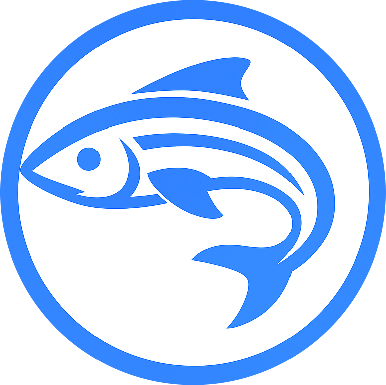

# REMORA - Reactive Engine for Mocked Runtime Actions

----

## Overview
**REMORA Engine** is a fast, lightweight and extensible rules engine designed to generate and replicate behavioral patterns for specific requests. It leverages the concept of a Minnow, which represents a profiled resource with defined behaviors, to simulate actions and responses in a controlled environment.  
REMORA allows developers to mock complex workflows and interactions dynamically, providing predictable yet flexible outcomes for testing, prototyping, or runtime simulation. Its architecture is modular, with the **Harbor** layer for request routing and workload coordination, the **Tidal** engine for behavior evaluation and the **Benthos** registry for persistence abstraction.  
If you're wondering, the name REMORA is an acronym:
 - <i><b>R</b></i>eactive <i><b>E</b></i>ngine – a system that dynamically responds to behavioral patterns.
 - <i><b>Mo</b></i>cked <i><b>R</b></i>untime <i><b>A</b></i>ctions – simulates behaviors and actions executed and observed in real-time.

## How to start using REMORA Engine
If you want to instantiate a local replica of REMORA Engine via Docker, 
please follow the [related documentation](https://github.com/andrea-deri/remora/tree/main/docker/README.md). 

## How to start contributing on REMORA Engine
**Note:** Contributing is currently disabled as the REMORA Engine is in an alpha phase.
Public contribution will open once the project reaches beta phase.

## Next steps
 - Read the [REMORA Engine documentation](https://github.com/andrea-deri/remora-engine/tree/main/docs/README.md)
 - [Open an issue](https://github.com/andrea-deri/remora-engine/issues) about bugfix or enhancement
